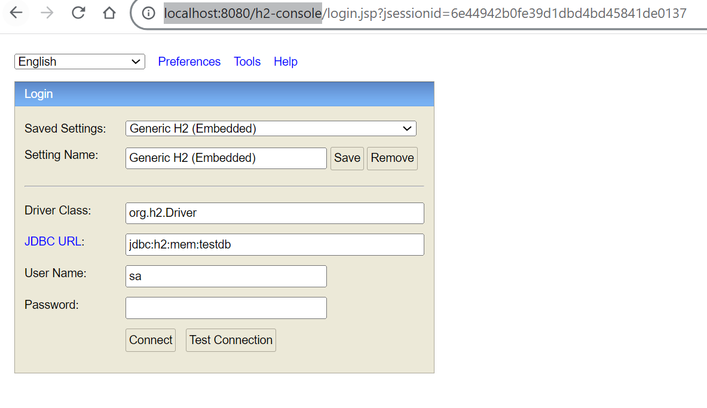
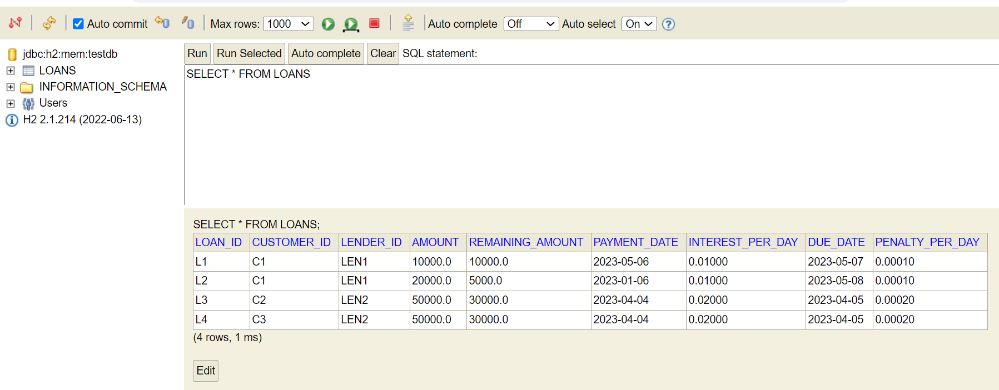
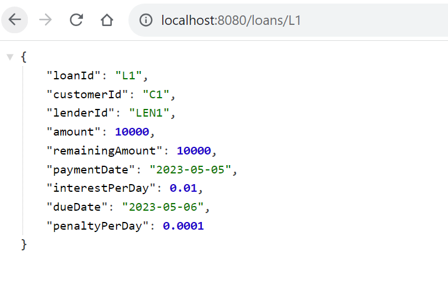
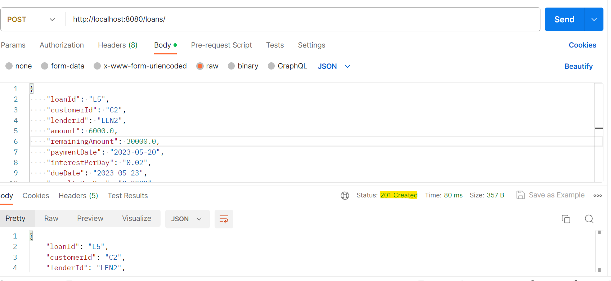
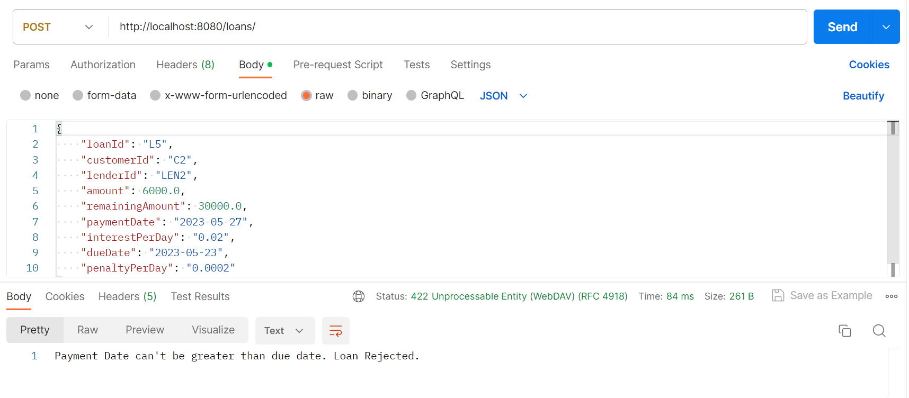
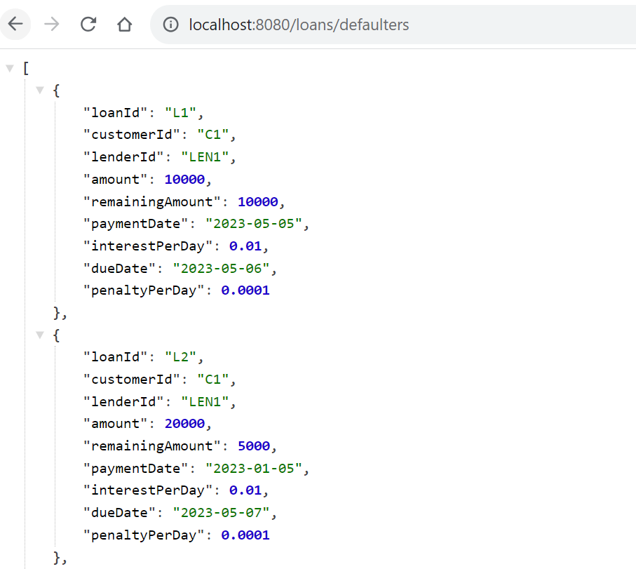
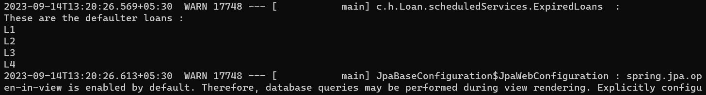
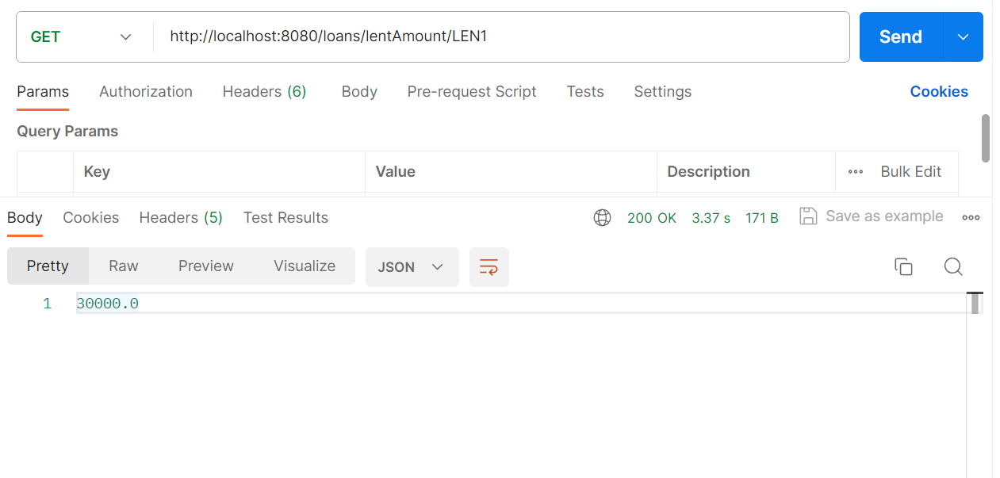
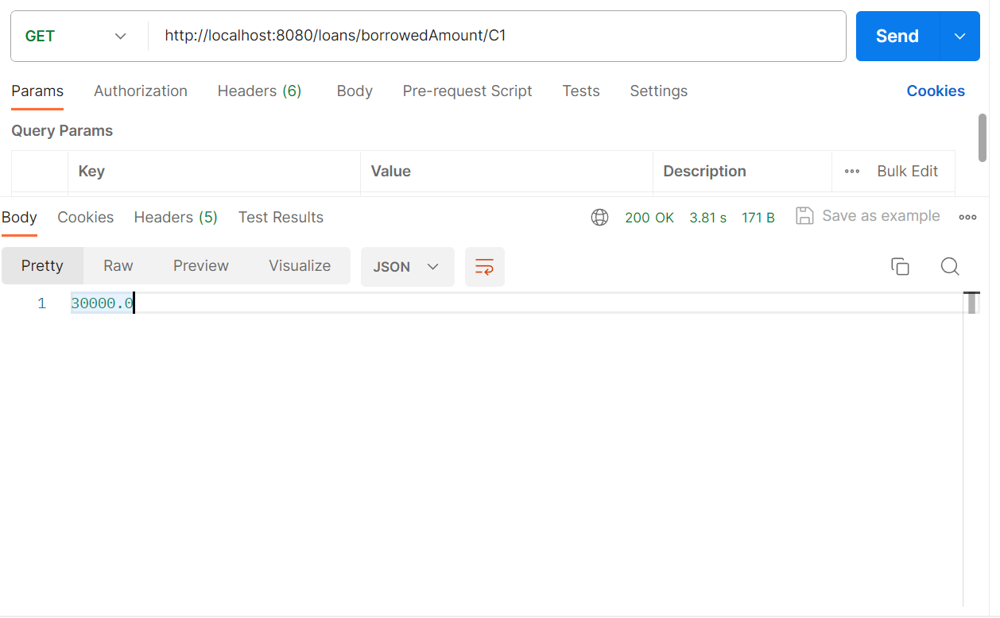

# Loan Transaction Application Assignment

A loan application for storing loan transactions. 

## Given Conditions of Assignment

There is a scenario where thousands of loans are flowing into one store, assume any way of
transmission of Loans. We need to create a one loan store, which store the loans in the following
order

  Given requirement/validation

1. The payment date can’t be greater than the Due Date. If its greater we have to reject the
   Loan and thrown the exception
2. We need to write an aggregation on the remaining amount, Interest and Penalty Group by
   Lender, Group by Interest and Group by Customer ID.
3. If the Loan crosses the due date, it should write an alert in the log message.

## Languages/ Frameworks used 

- Java 17  
- Spring Boot 3.1.3

## Architecture

There are 4 layers of the application -

### 1. Database Layer

The application uses an in memory and relational database H2 to keep the design minimal and simple.
It is already populated with some records on initialization. 

### 2. Data Access Layer 

The data access layer is responsible for storing, updating and retrieval of records from the database.It uses the JPA for implementing API methods and custom queries.

### 3. Service Layer

The service layer is where all the business logic and validation is kept. It is the middles layer between data access layer and the user.

 There are two services in this application

1. One that interacts with the data access layer.
2. Other service contains scheduled tasks.

### 4. Controller

This layer exposes the endpoints to the user for data manipulation, fetching and other operations.


## Testing 

The controller layer is tested using JUnit framework based on the principle of Red-Green factor.
Test Cases try to cover all the possible test cases.
You can check the test cases in `LoanApp/src/test/java/com/hkesari/Loan
/LoanApplicationTests.java`

## Installation and Running 

1. Make sure you have appropriate versions java and maven installed.
2. Clone the repository.
3. Go to the newly cloned directory.
4. Run the following command to build the application.
        
```
 mvn clean install
```

5. After successful build, run the application using (make sure you are in the root directory of the project)

```
mvn spring-boot:run
```


## Running the Service

Once your application is up and running, you can test various endpoints of the API.
By default, the application runs on 8080 port. You can change the default port and other properties in `src/main/resources/application.properties`

On the startup, the H2 database is already populated with records. To see them go to the h2 console as shown below.
Just click connect. Make sure your database name and password is same as in application.properties.

(By default there is no password)




Initial records in the database.



### Endpoints

BaseURL : http://localhost:8080/loans

1. Get all loans (/)

[GetLoans](images/get.png)

2. Get a loan by id (/L1)



3. Save Loan (/)



 If your payment date is greater than Due date, it will throw an exception.



4. Get defaulters list (/defaulters) - Loans whose due date has already passed.
 


This method is also used by the scheduled tasks service internally to log the list of defaulter loans at 8 am every morning.
Also, this will log the records on startup.



5.Total money lent by a single lender (/lentAmount/LEN1)



6.Total money borrowed by a single customer (borrowedAmount/C1)




